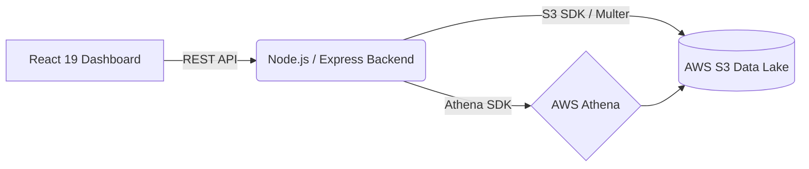

<div align="center">
  <h1>🚦 RoadGuard AI</h1>
  <p><strong>Next-Generation Cloud-Native Traffic Monitoring & Violation Analytics Dashboard</strong></p>
  
  
  
  
</div>

<br />

**RoadGuard AI** is a highly scalable, real-time traffic monitoring, and surveillance dashboard interface. It is architected to rapidly ingest, process, and visualize city-wide traffic camera feeds while reliably tracking traffic violations like overspeeding, wrong-side driving, and helmetless driving.

---

## 🌟 Key Features

### 🖥️ Frontend (React 19 Dashboard)
Designed with a state-of-the-art dark theme, leveraging **Material-UI (MUI)**, **Ant Design**, and **TailwindCSS** for a seamless user experience.
* **Live Surveillance Monitor (`/surveillance`)**: 
  * Interactive **Camera Grid** mimicking live CCTVs.
  * Real-time **Network Health** and **Camera Status** metrics.
  * Live **Violation Feed** highlighting events instantaneously with pop-up toast notifications.
* **Violation Explorer (`/violations`)**: 
  * Advanced **Ant Design Data Tables** with built-in instant debounced searches.
  * Multi-dimensional filtering by Location, Camera ID, Violation Type, and Date/Time limits.
  * One-click **CSV / JSON Exports** for violation reports.
  * Detailed modal breakdown indicating vehicle specifics, timestamp, speed, and violation category.
* **Analytics Platform**: Extensive graphical insights built on **Recharts** detailing daily trends and processing latency.

### ⚙️ Backend (Node.js API Layer)
A high-performance **Express** backend functioning as the primary interface between the React client and underlying Big Data cloud services.
* **AWS Athena Integration**: 
  * Custom polling system built using `@aws-sdk/client-athena` tracking query executions states.
  * Built-in **5-Second Query Caching Mechanism** to optimize Athena costs while delivering instant dashboard updates.
* **AWS S3 Storage Layer**: 
  * Direct file buffer uploads (`multer` + `@aws-sdk/client-s3`) capturing metadata like standard timestamps and UUID-based keys.
* **RESTful Endpoints**: Dedicated routes for `/analytics/cameras`, `/analytics/network-health`, `/violations`, and `/upload`.

---

## 🏗️ Technical Architecture



## 🚀 Getting Started

### Prerequisites
* **Node.js** (v18.0 or newer)
* **AWS Account** credentials configuring access to `S3` and `Athena` scopes.

### 1. Environment Configuration

In the `backend` directory, create a `.env` file:
```env
PORT=5000
AWS_REGION=ap-south-1
AWS_ACCESS_KEY_ID=your_access_key
AWS_SECRET_ACCESS_KEY=your_secret_key
ATHENA_DATABASE=roadguard_db
ATHENA_OUTPUT=s3://roadguard-traffic-data/athena-results/
S3_RAW_BUCKET=roadguard-traffic-data
```

### 2. Launching the Backend
```bash
cd backend
npm install
npm run dev
```

### 3. Launching the Frontend
Open a new terminal session and run:
```bash
cd roadguard-ai
npm install
npm run dev
```
Navigate to `http://localhost:5173` to interact with your dashboard.

---
> *Developed for performance, visual excellence, and modern urban traffic enforcement.*
